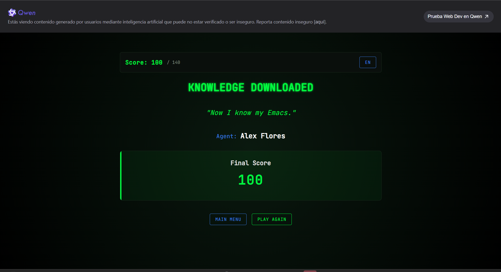
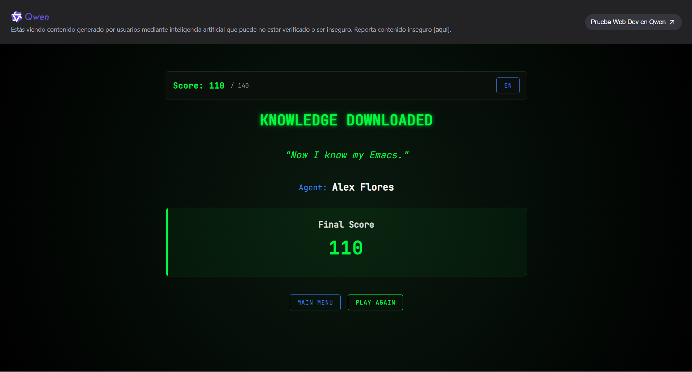
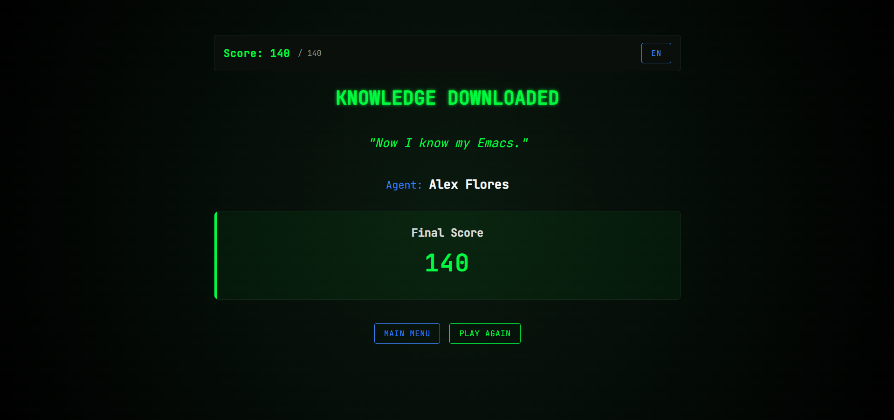
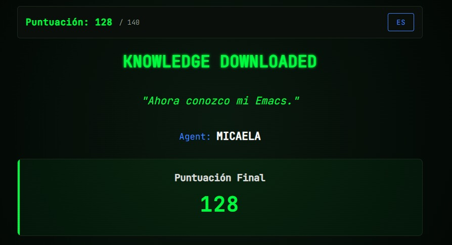
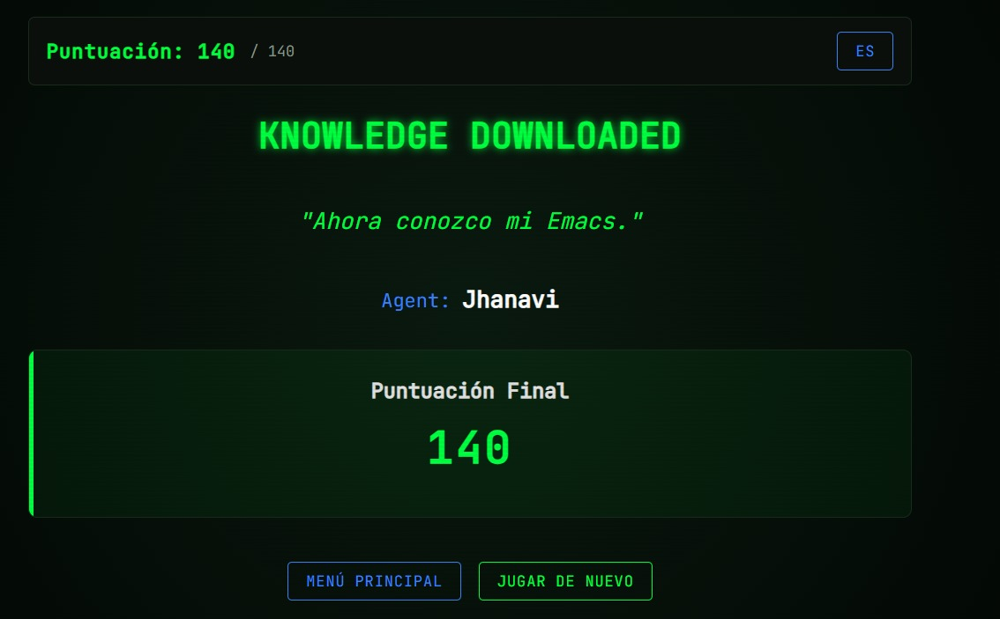
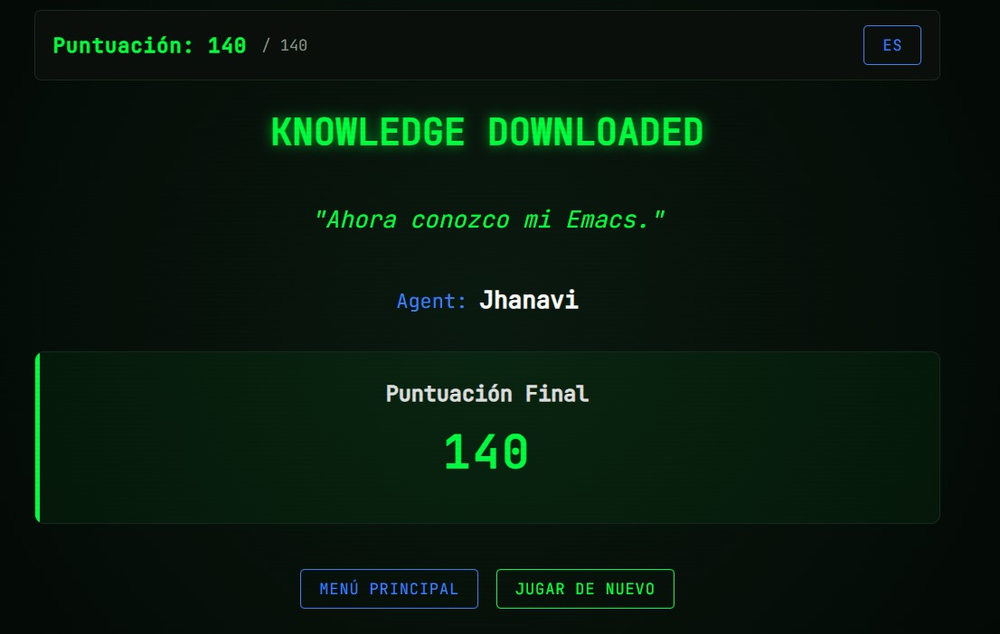
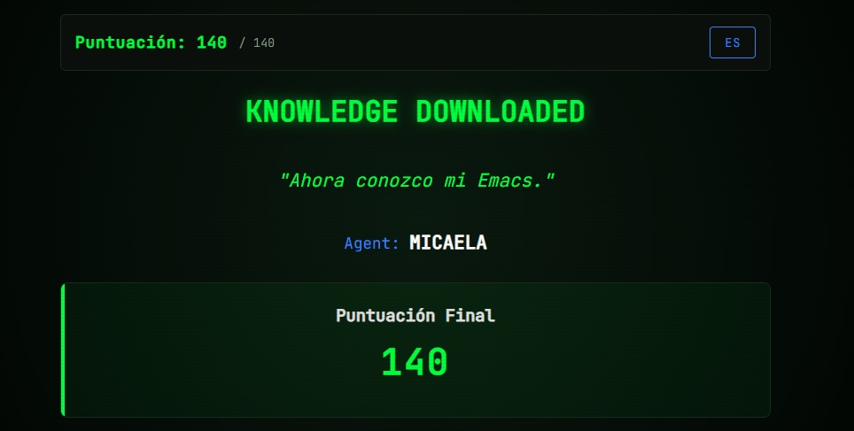

#+options: ':nil *:t -:t ::t <:t H:3 \n:nil ^:t arch:headline
#+options: author:t broken-links:nil c:nil creator:nil
#+options: d:(not "LOGBOOK") date:t e:t email:nil expand-links:t f:t
#+options: inline:t num:t p:nil pri:nil prop:nil stat:t tags:t
#+options: tasks:t tex:t timestamp:t title:t toc:nil todo:t |:t
#+title: Taller de Configuracion de Entorno WSL
#+date: 2026-04-18
#+author: Jami Mateo, Sagñay Micaela, Molina Jhanavi, Flores Alex, Sebastian
#+email: lenin.falconi@epn.edu.ec
#+language: Espanol
#+select_tags: export
#+exclude_tags: noexport
#+creator: Emacs 27.1 (Org mode 9.7.5)
#+cite_export:

#+latex_class: article
#+latex_class_options:
#+latex_header:
#+latex_header_extra:
#+description:
#+keywords:
#+subtitle:
#+latex_footnote_command: \footnote{%s%s}
#+latex_engraved_theme:
#+latex_compiler: pdflatex

#+latex_header: \usepackage{fancyhdr}
#+latex_header: \usepackage[top=25mm, left=25mm, right=25mm]{geometry}
#+latex_header: \usepackage{longtable}
#+latex_header: \fancyhead[R]{}
#+latex_header: \setlength\headheight{43.0pt}
#+LATEX_HEADER: \usepackage{tabularx}
#+LATEX_HEADER: \usepackage{longtable}

#+begin_export latex
\fancyhead[C]{\includegraphics[scale=0.05]{../images/logoEPN.jpg}\\
ESCUELA POLITECNICA NACIONAL\\FACULTAD DE INGENIERIA DE SISTEMAS\\
ARQUITECTURA DE COMPUTADORES}
\thispagestyle{fancy}
#+end_export

* Objetivos

- Configurar y validar el entorno de trabajo para la asignatura de Arquitectura de Computadores en Linux o WSL.
- Verificar la instalacion de herramientas base: mamba/anaconda (Python), Emacs y \LaTeX.
- Documentar evidencias tecnicas mediante capturas y comandos ejecutados.

* Instrucciones

1. Realice todas las actividades en Linux o en WSL.
2. En cada sección ejecute los comandos solicitados y registre la salida en el bloque correspondiente.
3. Guarde el archivo ~.org ~y exporte a ~.pdf~ con el comando `org-latex-export-to-pdf`.
4. Suba al aula virtual tanto el ~.org~ como el ~.pdf~. El formato
   final del ~.pdf~ no es relevante.
5. Verifique que estén todos los nombres de los integrantes del grupo
   de trabajo. Los grupos para este trabajo están en [[https://epnecuador.sharepoint.com/:x:/s/ICCD332-ArquitecturaComputadores/IQCjNuELSDbJTb42EfrLL2ksATBSbitbZ9_iFLJxIiCtSr0?e=gowv5I][Equipos de Trabajo]].
6. Verifique que en las distintas secciones de este archivo esté
   identificado con nombre e email el aporte del estudiante.

Si require insertar una imagen, crear una carpeta ~images~ y colocar
la imagen dentro. Para llamar la imagen desde Emacs use ~C-c C-l~ y
busque el archivo o escriba:Puede insertar una imagen con la sintaxis:

#+begin_src org
[[./images/image1.jpg]]
#+end_src
* Actividades
** Configuración de WSL con Ubuntu, \LaTeX, Python e Emacs

1. Verificacion de entorno mamba/anaconda
   1. Active WSL (si aplica) y su entorno de trabajo.
   2. Ejecute ~mamba info~ con ~C-c C-c~ dentro del bloque de código.
   3. Si el comando falla, active un entorno con ~mamba activate iccd332~ e intente de nuevo.

   #+begin_src shell :exports both :results verbatim
     mamba info
   #+end_src

   Alex Flores
   #+RESULTS:
   #+begin_example
      libmamba version : 2.5.0
         mamba version : 2.5.0
          curl version : libcurl/8.19.0 OpenSSL/3.6.1 zlib/1.3.2 zstd/1.5.7 libssh2/1.11.1 nghttp2/1.68.1 mit-krb5/1.22.2
    libarchive version : libarchive 3.8.6 zlib/1.3.2 liblzma/5.8.2 bz2lib/1.0.8 liblz4/1.10.0 libzstd/1.5.7 liblzo2/2.10 openssl/3.5.5 libb2/bundled
      envs directories : /home/alex/miniforge3/envs
         package cache : /home/alex/miniforge3/pkgs
                         /home/alex/.mamba/pkgs
           environment : iccd332 (active)
          env location : /home/alex/miniforge3/envs/iccd332
     user config files : /home/alex/.mambarc
    populated config files : /home/alex/miniforge3/.condarc
      base environment : /home/alex/miniforge3
   #+end_example

   Molina Jhanavi
   #+RESULTS:
   #+begin_example
      libmamba version : 2.5.0
         mamba version : 2.5.0
          curl version : libcurl/8.19.0 OpenSSL/3.6.1 zlib/1.3.2 zstd/1.5.7 libssh2/1.11.1 nghttp2/1.68.1 mit-krb5/1.22.2
    libarchive version : libarchive 3.8.6 zlib/1.3.2 liblzma/5.8.2 bz2lib/1.0.8 liblz4/1.10.0 libzstd/1.5.7 liblzo2/2.10 openssl/3.5.5 libb2/bundled
      envs directories : /home/jhanavi/miniforge3/envs
         package cache : /home/jhanavi/miniforge3/pkgs
                         /home/jhanavi/.mamba/pkgs
           environment : iccd332 (active)
          env location : /home/jhanavi/miniforge3/envs/iccd332
     user config files : /home/jhanavi/.mambarc
    populated config files : /home/jhanavi/miniforge3/.condarc
      base environment : /home/jhanavi/miniforge3
   #+end_example

   Sagñay Micaela
   #+RESULTS:
   #+begin_example
      libmamba version : 2.5.0
         mamba version : 2.5.0
          curl version : libcurl/8.19.0 OpenSSL/3.6.1 zlib/1.3.2 zstd/1.5.7 libssh2/1.11.1 nghttp2/1.68.1 mit-krb5/1.22.2
    libarchive version : libarchive 3.8.6 zlib/1.3.2 liblzma/5.8.2 bz2lib/1.0.8 liblz4/1.10.0 libzstd/1.5.7 liblzo2/2.10 openssl/3.5.5 libb2/bundled
      envs directories : /home/micaela/.local/share/mamba/envs
         package cache : /home/micaela/.local/share/mamba/pkgs
                         /home/micaela/.mamba/pkgs
           environment : /home/micaela/miniforge3 (active)
          env location : /home/micaela/miniforge3
     user config files : /home/micaela/.mambarc
    populated config files : /home/micaela/miniforge3/.condarc
      base environment : /home/micaela/.local/share/mamba
      platform : linux-64
   #+end_example

2. Verificacion de Python
   1. Active el entorno ~iccd332~ para abrir Emacs con ~mamba activate iccd332~.
   2. Ejecute ~python --version~ en la consola y desde Emacs.

   #+begin_src shell :exports both :results verbatim
    python --version
   #+end_src

   Alex Flores
   #+RESULTS:
   : Python 3.12.3

   Molina Jhanavi
   #+RESULTS:
   : Python 3.11.15

   Sagñay Micaela
   #+RESULTS:
   : Python 3.12.3

3. Verificacion de Emacs
   Ejecute ~emacs --version~ en la consola y desde Emacs.

   #+begin_src shell :exports both :results verbatim
     emacs --version
   #+end_src

   Alex Flores
   #+RESULTS:
   : GNU Emacs 29.3
   : Copyright (C) 2024 Free Software Foundation, Inc.
   : GNU Emacs comes with ABSOLUTELY NO WARRANTY.
   : You may redistribute copies of GNU Emacs
   : under the terms of the GNU General Public License.
   : For more information about these matters, see the file named COPYING.

   Molina Jhanavi
   #+RESULTS:
   : GNU Emacs 29.3
   : Copyright (C) 2024 Free Software Foundation, Inc.
   : GNU Emacs comes with ABSOLUTELY NO WARRANTY.
   : You may redistribute copies of GNU Emacs
   : under the terms of the GNU General Public License.
   : For more information about these matters, see the file named COPYING.

   Sagñay Micaela
   #+RESULTS:
   : GNU Emacs 29.3
   : Copyright (C) 2024 Free Software Foundation, Inc.
   : GNU Emacs comes with ABSOLUTELY NO WARRANTY.
   : You may redistribute copies of GNU Emacs
   : under the terms of the GNU General Public License.
   : For more information about these matters, see the file named COPYING.

4. Verificacion de LaTeX
   Ejecute ~latex --version~ en la consola y desde Emacs.

   #+begin_src shell :exports both :results verbatim
   latex --version
   #+end_src

   Alex Flores
   #+RESULTS:
   #+begin_example
   pdfTeX 3.141592653-2.6-1.40.25 (TeX Live 2023/Debian)
   kpathsea version 6.3.5
   Copyright 2023 Han The Thanh (pdfTeX) et al.
   There is NO warranty.  Redistribution of this software is
   covered by the terms of both the pdfTeX copyright and
   the Lesser GNU General Public License.
   For more information about these matters, see the file
   named COPYING and the pdfTeX source.
   Primary author of pdfTeX: Han The Thanh (pdfTeX) et al.
   Compiled with libpng 1.6.43; using libpng 1.6.43
   Compiled with zlib 1.3; using zlib 1.3
   Compiled with xpdf version 4.04
   #+end_example

   Molina Jhanavi
   #+RESULTS:
   #+begin_example
   pdfTeX 3.141592653-2.6-1.40.25 (TeX Live 2023/Debian)
   kpathsea version 6.3.5
   Copyright 2023 Han The Thanh (pdfTeX) et al.
   There is NO warranty.  Redistribution of this software is
   covered by the terms of both the pdfTeX copyright and
   the Lesser GNU General Public License.
   For more information about these matters, see the file
   named COPYING and the pdfTeX source.
   Primary author of pdfTeX: Han The Thanh (pdfTeX) et al.
   Compiled with libpng 1.6.43; using libpng 1.6.43
   Compiled with zlib 1.3; using zlib 1.3
   Compiled with xpdf version 4.04
   #+end_example

   Sagñay Micaela
   #+RESULTS:
   #+begin_example
   pdfTeX 3.141592653-2.6-1.40.25 (TeX Live 2023/Debian)
   kpathsea version 6.3.5
   Copyright 2023 Han The Thanh (pdfTeX) et al.
   There is NO warranty.  Redistribution of this software is
   covered by the terms of both the pdfTeX copyright and
   the Lesser GNU General Public License.
   For more information about these matters, see the file
   named COPYING and the pdfTeX source.
   Primary author of pdfTeX: Han The Thanh (pdfTeX) et al.
   Compiled with libpng 1.6.43; using libpng 1.6.43
   Compiled with zlib 1.3; using zlib 1.3
   Compiled with xpdf version 4.04
   #+end_example

5. Registro de problemas y solucion aplicada

Complete la siguiente tabla si tuvo errores durante la configuracion:

#+ATTR_LATEX: :environment tabularx :width \textwidth :align lXX
| *Herramienta* | *Problema observado* | *Solucion aplicada* |
|---------------+----------------------+---------------------|
|               |                      |                     |
|               |                      |                     |
|               |                      |                     |

** Comandos Emacs Tutorial
Seguir el tutorial integrado en Emacs al respecto de la navegación y
operaciones más frecuentes. El tutorial puede ser accedido en Español
utilizando el comando:

#+begin_src emacs-lisp
M-x help-with-tutorial-spec-language
#+end_src

Realice los ejercicios del tutorial (al menos un 80% del texto) y
complete la siguiente tabla con los comandos que considere de mayor
interés. Verifique que en la parte superior se active el menú de
tabla. Dentro de la región de la tabla puede dar C-c C-c para alinear
automáticamente la tabla al contenido del texto que escriba. Para
generar una nueva fila escriba presione la tecla TAB

<Estudiante A>
#+ATTR_LATEX: :environment longtable :align |p{0.2\linewidth}|p{0.3\linewidth}|p{0.2\linewidth}|p{0.3\linewidth}|
| *Comando*         | *Descripción*               | *Comando* | *Descripción*                     |
|-------------------+-----------------------------+-----------+-----------------------------------|
| ~C-c C-e # latex~ | Insertar template de  latex | ~C-x C-s~ | Guardar los cambios en el archivo |
|                   |                             |           |                                   |
|                   |                             |           |                                   |

<Alex Flores>
#+ATTR_LATEX: :environment longtable :align |p{0.2\linewidth}|p{0.3\linewidth}|p{0.2\linewidth}|p{0.3\linewidth}|
| *Comando* | *Descripción*            | *Comando* | *Descripción*                     |
|-----------+--------------------------+-----------+-----------------------------------|
| ~C-x C-f~ | Abrir un archivo         | ~C-x C-s~ | Guardar los cambios en el archivo |
| ~C-x C-c~ | Salir de Emacs           | ~C-g~     | Cancelar la acción actual         |
| ~C-b~     | Mover cursor hacia atrás | ~C-f~     | Mover cursor hacia adelante       |
| ~C-n~     | Mover cursor hacia abajo | ~C-p~     | Mover cursor hacia arriba         |
|           |                          |           |                                   |

<Molina Jhanavi>
#+ATTR_LATEX: :environment longtable :align |p{0.2\linewidth}|p{0.3\linewidth}|p{0.2\linewidth}|p{0.3\linewidth}|
| *Comando*         | *Descripción*                                         | *Comando* | *Descripción*                      |
|-------------------+-------------------------------------------------------+-----------+------------------------------------|
| ~C-c C-e # latex~ | Insertar template de  latex                           | ~C-x C-s~ | Guardar los cambios en el archivo  |
| ~C-v~             | Avanzar una pantalla completa                         | ~M-v~     | Retroceder una pantalla completa   |
| ~C-l~             | Limpiar la pantalla y mostrar todo el texto al cursor | ~C-f~     | Moverse un caracter hacia adelante |
| ~C-b~             | Retroceder un caracter                                | ~M-f~     | Moverse por palabras hacia delante |
| ~M-b~             | Moverse hacia atrás por palabras                      | ~C-a~     | Moverse al inicio de una línea     |
| ~C-e~             | Moverse al final de la línea                          | ~M-a~     | Moverse adelante por párrafos      |
| ~M-e~             | Moverse hacia atrás por párrafos                      | ~C-g~     | Detener un comando                 |
| ~C-k~             | Eliminar una línea completa                           | ~C-y~     | Pegar el texto borrado             |
| ~C-x C-f~         | Encontrar un archivo                                  | ~C-x C-s~ | Guardar                            |
| ~C-x b~           | Escoger un archivo                                    | ~C-x 1~   | Quitar la doble ventana            |

<Sagñay Micaela>
#+ATTR_LATEX: :environment longtable :align |p{0.2\linewidth}|p{0.3\linewidth}|p{0.2\linewidth}|p{0.3\linewidth}|
| *Comando*         | *Descripción*               | *Comando* | *Descripción*                     |
|-------------------+-----------------------------+-----------+-----------------------------------|
| ~C-c C-e # latex~ | Insertar template de  latex | ~C-x C-s~ | Guardar los cambios en el archivo |
| ~C-f~             | Mover adelante (Forward)    | ~C-b~     | Mover atrás (Backward)            |
| ~C-n~             | Siguiente línea (Next)      | ~C-p~     | Línea anterior (Previous)         |
| ~C-a~             | Ir al inicio de la línea    | ~C-e~     | Ir al final de la línea           |
| ~M-f~             | Avanzar una palabra         | ~M-b~     | Retroceder una palabra            |
| ~C-d~             | Borrar carácter (Delete     | ~C-k~     | Cortar línea (Kill)               |
| ~C-y~             | Pegar (Yank)                | ~C-/~     | Deshacer (Undo)                   |
| ~C-x C-f~         | Abrir archivo (Find)        | ~C-x C-s~ | Guardar cambios (Save)            |
| ~C-x 2~           | Dividir ventana horizontal  | ~C-x 3~   | Dividir ventana vertical          |
| ~C-x 1~           | Cerrar otras ventanas       | ~C-x o~   | Ir a la otra ventana              |
| ~C-x b~           | Cambiar de Búfer            | ~C-x k~   | Cerrar Búfer actual               |
| ~C-s~             | Buscar texto adelante       | ~C-r~     | Buscar texto atrás                |
| ~C-c C-c~         | Ejecutar bloque de código   | ~C-c C-e~ | Exportar (LaTeX/PDF)              |
| ~C-x C-c~         | Salir de Emacs              | ~C-g~     | Cancelar comando                  |
|                   |                             |           |                                   |
** Comandos Emacs Juego
En la anterior sección usted revisó los comandos de mayor interés
sobre la manipulación de Emacs. Es hora de poner en práctica sus
conocimientos. Realice unas 3 visitas al juego  [[https://chat.qwen.ai/s/deploy/t_23ff57ef-b59a-4bd7-9b79-54679b33686d][Emacs-Trainer]] y apunte
en la siguiente tabla su puntaje.

Estudiante A: 
|-----------+---------|
| iteración | Puntaje |
|-----------+---------|
|         1 |         |
|         2 |         |
|         3 |         |
|-----------+---------|

#+begin_src org
[[./estudianteA-game.png]]
#+end_src

Alex Flores: 
|-----------+---------|
| iteración | Puntaje |
|-----------+---------|
|         1 | 100     |
|         2 | 110     |
|         3 | 140     |
|-----------+---------|

  
#+end_src

Molina Jhanavi: 
|-----------+---------|
| iteración | Puntaje |
|-----------+---------|
|         1 |   124   |
|         2 |   140   |
|         3 |   140   |
|-----------+---------|

Sagñay Micaela: 
|-----------+---------|
| iteración | Puntaje |
|-----------+---------|
|         1 |  128    |
|         2 |  140    |
|         3 |  140    |
|-----------+---------|

[[./Juego1.png]]

[[./Juego3.png]]

** Usando Emacs para tener Ayuda sobre Emacs
¿Qué comandos le resultan más fáciles de usar y cuáles le son más
extraños? Identifique 4 comandos que le sean fáciles y 4 que le
resulten complicados. Revise qué dice la ayuda de Emacs sobre cada
comando y escriba en sus palabras el para qué sirve.

Para consultar lo que hace un comando ejecute:
1. ~C-h k~
2. Emacs le preguntara cuál es la combinación de la que requiere
   ayuda. Presione las teclas del comando. Por ejemplo, ~C-x C-f~
3. Emacs abrirá un nuevo buffer con la descripción del comando.
4. Cambie al buffer de la ayuda con ~C-x o~
5. Seleccione el primer parrafo de ayuda ubicando el cursor al inicio
   del parrafo y activando la marcación de texto con
   ~C-SPC~. Seleccione avanzando por palabras ~M-f~ o directamente
   toda la linea ~C-e~
6. Una vez seleccionado, copie el texto con ~M-w~.
7. Regrese al buffer anterior con ~C-x o~.
8. Pegue el texto en <Pegar lo que dice el...> con ~C-y~

**Comandos Fáciles**
1. **Estudiante A:** <Poner el comando>. <Pegar lo que dice el primer párrafo de la ayuda>
2. **Alex Flores:** <C-x C-f>. <C-x C-f runs the command find-file (found in global-map), which is an interactive native-compiled Lisp function in ‘files.el’. It is used to open or create files in Emacs.>
3. **Molina Jhanavi:** ~C-x C-f~ Cambiar a un búfer visitando el archivo NOMBRE_ARCHIVO, creando uno si no existe ninguno

**Comandos Difíciles**
1. **Estudiante A:** <Poner el comando>. <Pegar lo que dice el primer párrafo de la ayuda>
2. **Alex Flores:** <C-h k>. <C-h k runs the command describe-key (found in global-map), which is an interactive native-compiled Lisp function in ‘help.el’. It displays documentation for the key sequence you press next, showing what command it is bound to and what it does.>
3. **Molina Jhanavi:** ~C-s~ El comando isearch-forward (que se encuentra en global-map), que es una función Lisp interactiva compilada de forma nativa en 'isearch.el'

* Equipo de Trabajo
Complete la información de los integrantes de grupo e indique el líder
de grupo. Por defecto será la primera persona designada en la lista compartida.

|----------------+---------------------------+-------------|
| Nombre         | email                     | Rol         |
|----------------+---------------------------+-------------|
| Jami Mateo     | mateo.jami@epn.edu.ec     | líder       |
| Sagñay Micaela | micaela.sagnay@epn.edu.ec | colaborador |
| Molina Jhanavi | jhanavi.molina@epn.edu.ec | colaborador |
| Flores Alex    | alex.flores01@epn.edu.ec  | colaborador |
|----------------+---------------------------+-------------|

* Verificación de Entregables [57%]:
Ejecute ~C-c C-c~ sobre los ítems de tarea según se hayan cumplido o
no. Si un ítem no pudo realizarse apunte en la siguiente sección las
razones al respecto.
- [X] Verificación de configuración de entorno WSL y paquetes del curso. 
- [X] Tutorial de Comandos Emacs realizado.
- [X] Captura de Imágenes y puntajes de Emacs Trainer App.
- [ ] Usando Emacs para tener ayuda sobre Emacs
- [X] Verifique que estén los nombres de los integrantes del equipo e
  identificado el líder.
- [ ] Revisión de ortografía con ~ispell~ en el buffer
- [ ] Generación de Archivo PDF ~M-x org-latex-export-to-pdf~
- [ ] Subir al aula virutal archivo ~.org~ y ~.pdf~
** Problemas con la Tarea/logísticos:
- Tarea $X_1$ no pudo completarse debido a
- Tarea $X_2$ no pudo completarse debido a
