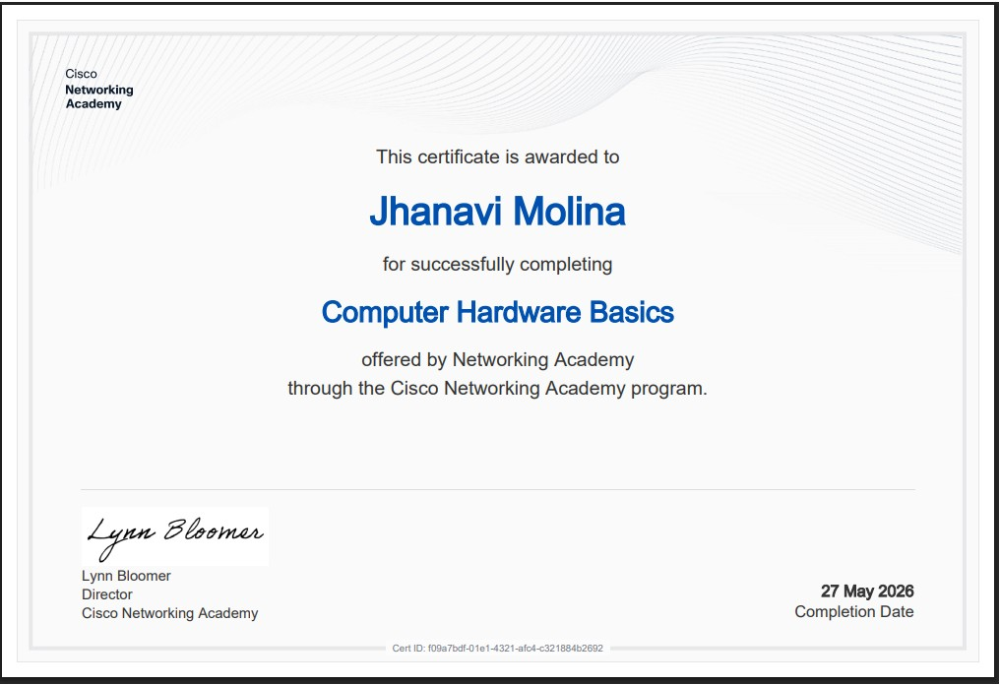
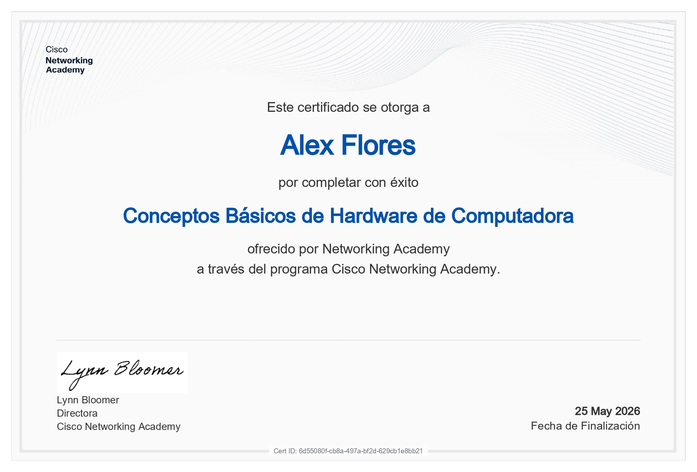
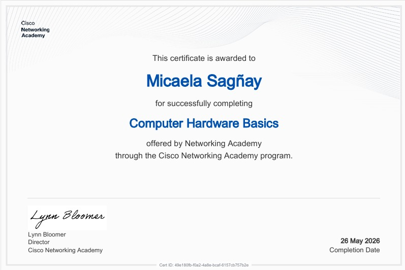

#+TITLE: Taller - Conceptos Básicos de Hardware y Ensamblaje de Computadores
#+SUBTITLE: ICCD332 Arquitectura de Computadores
#+AUTHOR: Alex Flores, Micaela Sagñay, Molina Jhanavi
#+DATE: 26/05/2026
#+OPTIONS: toc:nil num:t
#+LANGUAGE: es

#+latex_class: article
#+latex_class_options:
#+latex_header:
#+latex_header_extra:
#+description:
#+keywords:
#+subtitle:
#+latex_footnote_command: \footnote{%s%s}
#+latex_engraved_theme:
#+latex_compiler: latexmk

#+latex_header: \usepackage{fancyhdr}
#+latex_header: \usepackage[top=25mm, left=25mm, right=25mm]{geometry}
#+latex_header: \usepackage{longtable}
#+latex_header: \fancyhead[R]{}
#+latex_header: \setlength\headheight{43.0pt}
#+LATEX_HEADER: \usepackage{tabularx}
#+LATEX_HEADER: \usepackage{longtable}

#+cite_export: biblatex
#+LATEX_HEADER: \usepackage[backend=biber, style=ieee]{biblatex}
#+BIBLIOGRAPHY: ../bibliography/bibliography.bib

#+begin_export latex
\fancyhead[C]{\includegraphics[scale=0.05]{../images/logoEPN.jpg}\\
ESCUELA POLITECNICA NACIONAL\\FACULTAD DE INGENIERIA DE SISTEMAS\\
ARQUITECTURA DE COMPUTADORES}
\thispagestyle{fancy}
#+end_export

* Instrucciones generales

  Este taller se realiza en *grupos*. Cada integrante debe completar
  individualmente el curso Cisco Networking Academy:
  *Conceptos Básicos de Hardware de Computadora* y obtener su
  certificado de completitud. 

  *Entregables del grupo:*
  - Resolución de éste archivo fuente ~.org~
  - El PDF exportado desde Emacs ~M-x org-latex-export-to-pdf~
  - Los certificados individuales de cada integrante (PDF o imagen)

  *Entregable Individual(Tarea):*
  -  Resolver el cuestionario individual en el aula virtual
** Recursos
Cree su usuario en la plataforma de /Cisco Networking Academy/. Use el
siguiente enlace:

[[https://www.netacad.com/es/courses/computer-hardware-basics?courseLang=en-US][Cisco Computer Hardware Basics]]

Puede configurar según el idioma de su preferencia. El texto está
disponible en Español. Los vídeos disponen de subtítulos en varios
idiomas.

* Parte A. Integrantes y certificados
Para insertar la captura del certificado utilice YASnippet: Escriba
~fig_~ seguido de ~C-TAB~. Esto produce ~#+caption~, ~#+attr_latex~ y
~#+label~ que permiten colocar un encabezado a la imagen, controlar el
escalado de la misma y una referencia. Finalmente inserte el enlace al
archivo usando ~C-c C-l~ o usando ~[[./carpeta-certificados/cert-int1.pdf]]~
1. *Integrante 1*
   - *Nombre completo:* Jhanavi Abigail Molina Gómez
   - *Correo:*jhanavi.molina@epn.edu.ec
   - *Certificado adjunto:*
     #+begin_example
      #+caption: Certificado Molina Jhanavi
      #+attr_latex: scale=0.75
      #+label: fig:certificado-jhanavi
      
      
2. *Integrante 2*
   - *Nombre completo:* Alex Sebastian Flores Torres
   - *Correo:* alex.flores01@epn.edu.ec
   - *Certificado adjunto:* 
     
3. *Integrante 3*
   - *Nombre completo:* Micaela Dannae Sagñay Iza
   - *Correo:* micaela.sagnay@epn.edu.ec
   - *Certificado adjunto:*  
     #+caption: Certificado Micaela Sagñay
     #+attr_latex: scale=0.75
     #+label: fig:certificado-micaela
     
     
* Parte B. Cuestionario argumentado grupal

Para cada pregunta:

- Indique la alternativa escogida (letra).
- Escriba una justificación técnica breve (3 a 6 líneas). Fundamente
  su respuesta. Su insumo principal es el curso de Conceptos Básicos
  de Hardware. Si usa otro material referenciar.
- Discuta con el grupo de trabajo las opciones y la respuesta ¿Existió
  consenso? ¿Cuáles fueron las principales discrepancias?

*Criterio:* correcto/incorrecto + calidad del argumento técnico.

** Pregunta 1
Al instalar una CPU en un socket LGA, ¿por qué es crítico alinear el
pin 1 de la CPU con el pin 1 del socket?

a. Para que el sistema arranque con mayor rapidez 

b. Para evitar daños en la CPU y el socket al insertar incorrectamente

c. Porque el pin 1 es el único que conduce electricidad 

d. Para que el disipador quede centrado automáticamente

- /Alternativa escogida:/ Literal B
- /Justificación técnica:/ En los sockets los pines están en el socket, no en la
  CPU, alinear correctamente el pin 1 nos garantiza que el procesador se asiente
  sin forzar, evitando doblar o romper pines del socket.
- /Debate del grupo:/ Algunos consideraron inicialmente la opción A o D pero las
  pudimos descartar esas opciones porque la velocidad de arranque y la alineacion
  del disipador dependen de factores distintos, y la opción C es falsa ya que todos
  los pines conducen señales y energía.
** Pregunta 2
Al montar la placa madre en el gabinete, ¿cuál es la función de los separadores (standoffs)?

a. Sostener el peso de las tarjetas de expansión

b. Evitar cortocircuitos entre la placa madre y el metal del gabinete

c. Mejorar la ventilación de la placa madre

d. Facilitar la alineación del panel de E/S trasero

- /Alternativa escogida:/ B
- /Justificación técnica:/ Los separadores elevan la placa madre y crean un espacio
  entre sus pistas de cobre y soldaduras y la bandeja metalica del gabinete, esto previene
  contactos electricos no deseados que podrían provocar cortocircuitos o daños a la placa madre.
- /Debate del grupo:/ Hubo una discusión sobre la opción D ya que al instalar los separadores
  en los agujeros correctos si ayuda a que los puertos traseros coincidan con la chapa E/S, pero
  su razón de ser fundamental es aislar electricamente la placa del chasis.

** Pregunta 3      
Según el manual de ensamblaje de Cisco, ¿cuándo NO es necesario aplicar pasta térmica al instalar el disipador sobre la CPU?

a. Cuando la CPU es de alto rendimiento

b. Cuando el disipador ya incluye pasta térmica preaplicada

c. Cuando la CPU tiene más de un año de uso

d. Cuando el gabinete tiene buena ventilación

- /Alternativa escogida:/ B
- /Justificación técnica:/ La pasta termica es necesaria para llenar las microimperfecciones entre la superficie de la CPU
  y la base del disipador, mejorando la transferencia de calor, muchos disipadores comerciales incluyen una capa
  preaplicada, aplicar pasta adicional sobre una ya existente puede crear una capa demasiado gruesa
  reduciendo la eficiencia térmica o incluso causando derrames sobre el socket.
- /Debate del grupo:/ Hubo un descarte entre todas las opciones excepto la B, la opcion A, los CPUS de alto rendimiento
  si requiere pasta, en la opción C la antiguedad del CPU no es relevante, si se reinstala un disipador usado
  si debe limpiarse y aplicar pasta nueva pero eso no es no aplicar, en la opcion D, la ventilacion del gabinete
  no reemplaza la necesidad de contacto térmico adecuado.

** Pregunta 4
¿Por qué se recomienda usar pulsera antiestática y alfombrilla antiestática al manipular componentes internos?

a. Para proteger al técnico de descargas de 220 V

b. Para evitar que la electricidad estática dañe los componentes

c. Para cumplir una norma estética del laboratorio

d. Para que los tornillos no se magneticen

- /Alternativa escogida:/ [a completar]
- /Justificación técnica:/ [a completar]
- /Debate del grupo:/ [a completar]
** Pregunta 5
Si al iniciar la computadora por primera vez un LED del panel frontal no funciona, ¿qué indica el manual de Cisco?

a. Reemplazar el conector por uno de repuesto

b. Revisar el BIOS para habilitar el LED

c. Quitar el conector, invertirlo y volver a conectarlo

d. Desconectar y reconectar la fuente de poder

- /Alternativa escogida:/ [a completar]
- /Justificación técnica:/ [a completar]
- /Debate del grupo:/ [a completar]

** Pregunta 6
¿Por qué una GPU puede requerir un conector de alimentación PCIe adicional de la fuente de poder?

a. Porque la ranura PCIe no transmite señal de video

b. Porque las GPUs de alto rendimiento consumen más potencia de la que la ranura puede suministrar

c. Porque el conector PCIe solo funciona con tarjetas de red

d. Por el estándar de codificación de color de los cables SATA

- /Alternativa escogida:/ [a completar]
- /Justificación técnica:/ [a completar]
- /Debate del grupo:/ [a completar]

* Parte C. Mantenimiento de computadores

** 3.1 Insumos para mantenimiento preventivo
   Liste al menos seis insumos y describa para qué sirve cada
   uno. Revise el siguiente [[https://youtu.be/3ri1BMV7XTM?si=bjYoDUUKuMWwj4Qg][vídeo]].

   | Insumo               | Uso principal                                    |
   |----------------------+--------------------------------------------------|
   | Aire comprimido      | Eliminar polvo de componentes y ventiladores     |
   | Alcohol isopropílico | Limpiar componentes electrónicos sin dañarlos    |
   | Brocha antiestática  | Retirar polvo de tarjetas y partes delicadas     |
   | Pasta térmica        | Mejorar la transferencia de calor del procesador |
   | Paño de microfibra   | Limpiar pantallas y superficies                  |
   | Pulsera antiestática | Evitar descargas eléctricas en los componentes                                                 |

** 3.2 Procedimiento de limpieza — Desktop
   1.Apagar y desconectar el computador de la corriente.
   2.Abrir el case con cuidado utilizando herramientas adecuadas.
   3.Retirar el polvo interno usando aire comprimido y brocha antiestática.
   4.Limpiar ventiladores, memoria RAM y demás componentes.
   5.Cerrar el equipo y verificar su correcto funcionamiento.

** 3.3 Procedimiento de limpieza — Laptop
   1.Apagar la laptop y desconectar el cargador.
   2.Retirar la tapa inferior cuidadosamente.
   3.Limpiar ventiladores y salidas de aire con aire comprimido.
   4.Limpiar teclado, pantalla y superficie externa con paño de microfibra.
   5.Ensamblar nuevamente la laptop y comprobar su funcionamiento.

* Parte D. Aprendizaje obtenido

** Integrante 1 [Jhanavi Molina]
   - *¿Qué conocimiento nuevo obtuvo del curso?* [Aprendí a identificar los componentes principales de una computadora como el CPU, memoria RAM, placa madre, disco duro y fuente de poder, tambien aprendí como se los ensambla correctamente.]
   - *¿Qué concepto corrigió o clarificó?* [Entendí que la pasta térmica no es opcional, si no necesaria para que la CPU no se sobrecaliente, antes no sabía o no tenía claro el concepto de para que servia.]
** Integrante 2 [Alex Flores]
   - *¿Qué conocimiento nuevo obtuvo del curso?* [Aprendí lo basico sobre mantenimiento tanto de PCs de escritorio como de laptops, tambien aprendi mas a fondo sobre los componentes, algunas buenas practicas de ensamblaje y limpieza de componentes]
   - *¿Qué concepto corrigió o clarificó?* [Me quedó mas claro como funcionan los componentes como RAM o procesador a nivel hardware, algunas practicas malas que tenia como claras en mi cabeza se aclararon y tambien corregi la manera de manipular los componentes]

** Integrante 3 [Micaela Sagñay]
   - *¿Qué conocimiento nuevo obtuvo del curso?* [Obtuve conocimientos fundamentales sobre el mantenimiento preventivo y correctivo tanto en computadoras de escritorio como en laptops, además de profundizar en la arquitectura interna de los componentes y las normativas de seguridad para el ensamblaje.]
   - *¿Qué concepto corrigió o clarificó?* [Clarifique el funcionamiento a nivel de hardware de los componentes críticos como la memoria RAM y el procesador, además de corregir prácticas incorrectas de manipulación de componentes, adoptando técnicas adecuadas de limpieza y manejo de hardware.]
     
* Rúbrica de evaluación

  | Criterio                               | Puntaje máximo |
  |----------------------------------------+----------------|
  | Certificados individuales completos    |             20 |
  | Cuestionario: respuesta correcta (x8)  |             30 |
  | Cuestionario: argumento técnico (x8)   |             30 |
  | Mantenimiento (tabla + procedimientos) |             20 |
  | TOTAL                                  |            100 |

* ¿Cómo referenciar en Emacs?
Para insertar una referencia a un recurso bibliográfico
1. Puede actualizar el archivo ~../bibliography/bibliography.bib~
2. Escribir en formato **BibTeX** el recurso bibliográfico
3. Verifique la siguiente configuración al encabezado:
   #+begin_src org
   #+cite_export: biblatex
   #+LATEX_HEADER: \usepackage[backend=biber, style=ieee]{biblatex}
   #+BIBLIOGRAPHY: ../bibliography/bibliography.bib
   #+end_src
4. Usar ~M-x org-cite-insert~ para insertar una cita. Aparecerá una
   lista. Use los cursores para seleccionar la cita. Ejecute ~C-RET~: /De acuerdo con
   [cite:@ledin2022modern], la arquitectura ...../
5. Revise que al final del documento exista ~#+print_bibliography:~
6. **Sugerencia:** Para evitar repetir varias veces el proceso de
   exportación, es recomendable cambiar el compilador de \LaTeX a
   ~latexmk~. Para esto:
   - ~sudo apt install latexmk~
   - Revise en el encabezado del ~.org~ que el compilador escogido sea
     ~#+LATEX_COMPILER: latexmk~. También puede modificar el archivo
     ~init.el~ para indicar qué compilador se usa para exportar de
     ~.org~ a /LaTeX/:
     #+begin_src elisp
;; 4.7b Proceso de compilación con latexmk para Org-export
(with-eval-after-load 'ox-latex
  (setq org-latex-pdf-process
        '("latexmk -f -pdf -%latex -interaction=nonstopmode -output-directory=%o %f")))

;; 4.7c Org-cite: biblatex como procesador para exportación LaTeX
(with-eval-after-load 'oc
  (setq org-cite-export-processors
        '((latex biblatex)
          (t basic))))

     #+end_src
* Verificación de Entregables [100%]:
Ejecute ~C-c C-c~ sobre los ítems de tarea según se hayan cumplido o
no. Si un ítem no pudo realizarse apunte en la siguiente sección las
razones al respecto.
- [X] Los enlaces a los certificados en el documento ~.org~ funcionan.
- [X] Resolución completa del Cuestionario2.
- [X] Revisión del vídeo sobre mantenimiento a computador ASUS. 
- [X] Tutorial de Comandos Emacs realizado.
- [X] Lista de insumos para mantenimiento completa.
- [X] Procedimiento de mantenimiento para desktop completo.
- [X] Procedimiento de mantenimiento para laptop completo.
- [X] Revisión de ortografía con ~ispell-buffer~ en el buffer
- [X] Generación de Archivo PDF ~M-x org-latex-export-to-pdf~
- [X] Subir al aula virutal archivo ~.org~ y ~.pdf~

#+print_bibliography:
